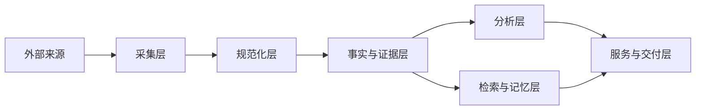
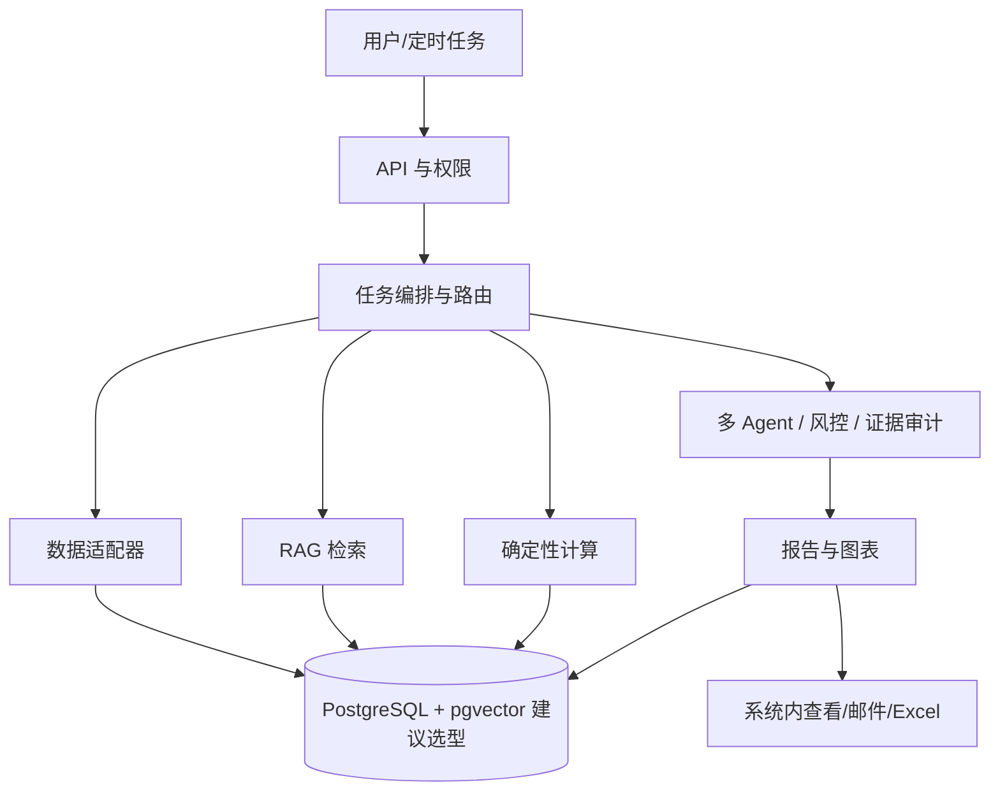
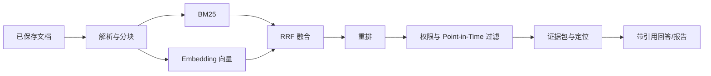

# 技术方案

状态：多 Agent、金融 RAG、Point-in-Time 与可追溯数据要求已确认；Agent 角色拆分、检索流程和具体技术栈为暂定或候选方案。Python、SQL 是确定的能力展示要求，框架、模型、数据库和行情最终供应商待定，未部署任何服务。

## 模块划分

客户端承载搜索、自选股逐股配置、报告、历史和通知设置，以及 K线、财务、新闻情绪、行业对比可视化。应用服务负责身份与权限、请求校验和任务状态。任务编排协调数据适配器、金融 RAG、Agent 分析及报告持久化。调度模块根据交易日历触发分钟监控、收盘报告和复盘，通知模块处理系统消息与邮件。

建议将原始资料与证据快照、结构化业务记录、检索索引分开管理；具体存储方案待数据规模与部署预算明确后确定。

## 六层数据架构（建议方案，未冻结）

为保持来源、计算和生成内容可追溯，建议把数据链路拆成六层。各层是逻辑边界，不代表已经创建数据库或部署服务。

1. **采集层**：数据源适配器、限流、超时、重试和原始响应登记；记录供应商、请求时间和状态。
2. **规范化层**：证券映射、时间统一为 UTC、币种/单位标准化、公司行动和交易日历处理；保留原始字段与版本。
3. **事实与证据层**：保存行情、财报、公告、新闻和宏观事实，以及 `source`、`event_time`、`published_at`、`retrieved_at`、`as_of`、`freshness`、许可和定位信息。
4. **分析层**：确定性指标、事件特征、缺失/冲突检查和 Point-in-Time 过滤；只读截止时点前可用数据。
5. **检索与记忆层**：文档分块、关键词/向量索引、RRF/Reranker 结果、任务上下文和历史判断；索引记录数据版本及权限。
6. **服务与交付层**：报告、图表、K线和 Excel 导出、通知、审计日志与复盘结果；输出始终引用保存的数据快照。

建议的 MVP 选型是 PostgreSQL 作为结构化事实、权限和任务状态的主存储，pgvector 作为同库向量检索扩展，便于事务、权限和证据版本保持一致。TimescaleDB、独立向量库或对象存储仍是候选；只有在数据规模、检索延迟、备份恢复、许可或运维成本的实测结果显示 PostgreSQL+pgvector 不足时，才评估迁移。该选型未冻结、未安装、未连接数据库。

## 系统、数据流与 RAG 图（建议方案）

## 初步数据表与更新策略

以下是内部表的初步设计，字段和索引待契约测试后调整：

| 表 | 关键字段 | 更新策略 |
| --- | --- | --- |
| `securities` | `security_id`, `ticker`, `exchange`, `currency`, `valid_from/to` | 主数据变更追加版本，不覆盖历史映射 |
| `market_bars` | `security_id`, `interval`, OHLCV, `event_time`, `source`, `retrieved_at` | 按来源和时间幂等写入，修订保留版本 |
| `documents` / `evidence_chunks` | 文档定位、公开时间、首次可用时间、内容哈希、向量 | 原文或版本变化追加，重建索引记录版本 |
| `facts` | 指标、数值、单位、币种、`as_of`、来源 | 规范化结果可重算，缺失与冲突显式保存 |
| `analysis_runs` / `judgments` | 用户、任务、截止时间、状态、模型/工具版本 | 状态机更新，原判断不可被复盘覆盖 |
| `reports` / `exports` | 报告快照、字段清单、导出格式、数据版本 | 保存后不可变；导出记录文件摘要和来源 |

行情按正常交易时段依据来源允许频率采集；收盘报告先确认数据到齐再生成；文档、公司行动和宏观数据按发布或更正事件增量更新。每次任务计算 `freshness`，源延迟、采集周期和检测延迟分开显示。允许范围内的 5–15 分钟行情延迟不自动判故障，超过新鲜度上限、关键数据缺失或来源失败则降级。

## 失败降级、K线与 Excel 接口

适配器遇到限流、超时或来源中断时执行有限重试和退避；仍失败则标记 `failed` 或 `partial`，保留已成功来源和缺失原因。关键证据缺失时报告状态为 `evidence_insufficient`，禁止生成确定性结论。通知失败仍保存系统内报告；任务恢复沿用幂等键和 `run_id`，不重复告警或导出。

建议接口（路径和字段未冻结）包括 `GET /securities/{id}/bars?interval=1d&from=&to=&adjusted=` 返回带来源、时间、币种、单位和复权口径的 K 线；`POST /reports/{id}/exports` 生成 `xlsx` 导出任务，`GET /exports/{id}` 查询状态和文件摘要。Excel 必须从已保存的报告/事实/证据快照导出，不能由 LLM 临时生成或补写数字。每个数值列及元数据应包含来源、事件/公开/采集时间、币种、单位、延迟/新鲜度和缺失或冲突说明。

### P0 应用接口契约草案（建议，未冻结）

为让 P0 闭环可直接进入原型和 PoC，先定义与 PRD 功能编号对应的最小接口；具体路径、鉴权方式和字段仍需契约测试确认：

| PRD | 方法与路径（草案） | 关键输入 | 关键输出/失败状态 |
| --- | --- | --- | --- |
| F01 | `GET /securities/search?q=&market=US` | 查询词、市场 | 候选证券、匹配状态；`empty`/`failed` |
| F02–F05 | `POST /analysis-runs`、`GET /analysis-runs/{run_id}` | `security_id`、`as_of`、任务类型 | 阶段状态、事实/计算/推断/风险、引用；`partial`/`evidence_insufficient`/`failed` |
| F06 | `GET /reports/{report_id}` | 报告 ID、用户权限 | 不可覆盖报告快照、数据版本、来源和限制；`404`/`forbidden` |
| F07 | `POST /watchlist`、`DELETE /watchlist/{security_id}` | 用户、证券和最小配置 | 保存/删除状态；`duplicate`/`forbidden` |
| F08 | `POST /close-reports`、`GET /close-reports/{report_id}` | 用户、交易日 | 收盘摘要和逐股报告；`partial`/`stale`/`failed` |
| F09/F11 | `GET /runs/{run_id}/events`、`GET /deliveries/{id}` | 运行或投递 ID | 耗时、Token/成本依据、通知状态；`retryable`/`failed` |

所有 P0 接口均需透传 `source`、`as_of`、`retrieved_at`、freshness、数据版本和用户隔离上下文；缺失字段必须表达原因，不能用默认零值代替。接口只描述候选契约，当前未实现、未连接服务。

## PoC 清单（未执行）

1. 用标记为 synthetic 的离线样本验证六层字段、权限隔离、缺失/冲突和 Point-in-Time 过滤。
2. ResearchSnapshot 作为后续报告、Excel、API、RAG 和前端接入的统一快照契约；当前仅完成离线 synthetic 实现。
3. 对 PostgreSQL+pgvector 建议选型测试结构化查询、向量检索、备份恢复和索引重建；与轻量替代方案比较，不预先宣称性能。
3. 验证 SEC 文档定位、BM25+向量+RRF 检索和引用覆盖，包含截止时间边界。
4. 验证 K线接口的时区、公司行动、缺口和延迟状态。
5. 验证 Excel 导出字段完整性、来源元数据、缺失值表达、幂等和权限。
6. 验证限流、超时、重试、任务恢复、重复事件及部分完成状态。

以上 PoC 尚未运行；本阶段不安装依赖、不连接 API 或数据库。

## 分析流水线

1. Router/Planner（意图识别与任务规划角色）解析用户问题、证券、时间范围与会话记忆，按复杂度安排必要角色；综合研究由行情、基本面、新闻事件、行业与宏观 Agent 取得有时间戳的数据与文档，覆盖行情、技术面、基本面、新闻情绪、行业、宏观和风险。
2. RAG（先检索资料再基于资料回答）返回证据包，保留文档版本、片段位置及相关性；确定性计算产生必要指标。
3. 对需要综合判断的任务，多头与空头基于同一证据截止时间独立分析，再按有限轮次质疑对方证据。
4. Evidence Auditor（证据审计角色）检查数据、时间、引用及推理链，识别新闻晚于价格变化等归因错误；风控检查过期或缺失数据、流动性、事件风险、证据冲突和越界建议，输出可解释风险标记。
5. 裁判综合证据而非简单多数投票；保留未解决分歧。关键真实性检查失败时必须输出证据不足，不得绕过风控形成确定结论。
6. 报告 Agent 汇总完整报告与可视化；保存每次判断、引用、模型及提示版本、工具状态和成本，再触发已配置通知。复盘 Agent 在 5/20 个交易日后评估原判断并更新分组表现统计。

Agent 是运行时角色；仓库 Skill 是标准化流程，两者不要求一一对应。调度和权限不能依赖模型自由决定。

## 规划中的内部数据契约

以下是内部字段建议，不代表外部 API 存在。

| 对象 | 核心字段 |
| --- | --- |
| Security | 内部 ID、ticker、交易所、类型、币种、标识有效期 |
| Evidence | 来源 ID、定位、发布时间、采集时间、当时可用时间、截止时间、单位、许可标记、内容摘要或哈希 |
| AnalysisRun | 任务 ID、用户 ID、证券 ID、状态、截止时间、数据/模型/提示/配置版本、失败原因 |
| Report | 报告 ID、任务 ID、类型、版本、观点、风险、引用、缺口、生成时间 |
| MonitorEvent | 证券、规则版本、事件时间、窗口、观测值、阈值、去重键 |
| Review | 原报告 ID、5/20 个交易日周期、到期时间、锚点、基准、数据版本、结果状态 |
| Notification | 用户、报告或事件 ID、渠道、幂等键、发送状态、尝试次数 |

## 调度与故障恢复

统一保存 UTC 时间，按 America/New_York 的市场日历计算正常交易会话并处理夏令时及提前收盘；MVP 不监控盘前盘后。允许 5–15 分钟源延迟，检查周期与数据时效分别处理。收盘任务需检查收盘数据到齐情况，等待规则待定，不以固定墙钟时刻断言数据完整。来源限流、超时与故障使用有限重试和退避，超过预算进入明确失败或部分完成状态。

监控按证券共享数据采集、按用户规则匹配；以证券、规则、窗口生成事件去重键。收盘报告按用户、交易日、版本幂等。复盘任务随原报告落库登记，以原报告、周期、版本去重；重启后补偿漏跑任务。数据未齐不能把报告标为完整。

## 安全与可观测性

应用与数据层同时执行用户隔离；Agent 工具最小权限，外部内容作为数据读取。记录数据新鲜度、任务耗时、调用费用、引用覆盖、监控漏跑与投递失败，日志不包含密钥或不必要个人信息。技术选型需比较可维护性、许可、成本、恢复能力和离线测试支持。

## 建议方案：暂定 Agent 角色与职责

最新角色拆分为暂定方案，保留研究、多空、风险、裁判、报告和复盘能力，新增路由、Quant 与证据审计角色；并非每次请求都调用全部角色，记录选择原因与调用预算。

| 角色 | 职责 |
| --- | --- |
| Router/Planner | 识别意图、解析时间与实体，规划工具和必要角色，复用多轮上下文 |
| 行情Agent | 行情、技术面与异动证据 |
| 基本面Agent | 财报、公告、财务指标与金融 RAG |
| 新闻事件Agent | 新闻事件及情绪分析，区分文本情绪与事实 |
| 行业与宏观Agent | 行业对比、宏观数据及其影响假设 |
| Quant Agent | 通过确定性计算进行异常检测、事件研究和历史验证 |
| 多头Agent | 提出支持假设并质疑空头证据 |
| 空头Agent | 提出反证并质疑多头证据 |
| 风控Agent | 检查风险、极端情况与结论是否过度 |
| Evidence Auditor | 检查数据、时间、引用、推理链、替代解释及时间顺序错误 |
| 裁判Agent | 处理交叉辩论及证据冲突，形成有依据的结论 |
| 报告Agent | 整合研究、引用与可视化，形成完整报告 |
| 复盘Agent | 到期检验原判断，形成复盘与历史表现记录 |

## 建议方案：RAG 流程

文档解析 → 按章节、段落和表格进行 Chunk（分块） → BM25 关键词检索 → Embedding 语义检索 → RRF 融合 → Cross-Encoder Reranker → 截止时间过滤 → 提取证据 → 生成带引用回答 → 引用核验。

BM25 按关键词匹配，Embedding 将内容转为便于比较语义的向量，RRF 合并多路排序，Cross-Encoder Reranker 同时读取问题与候选内容重新排序。此链路是建议方案，需经评测决定实现；时间隔离和引用真实性是不可取消的要求。

BM25 与 Embedding 分别产生候选排序，再由 RRF 融合、Reranker 重排；两路检索不是将关键词结果作为语义检索的唯一输入。分块策略、模型、检索数量与参数待选。每一步保留版本及片段定位，检索前后均执行证券、权限和 Point-in-Time 过滤。

## Point-in-Time 与历史相似事件

为资料保留公开时间、首次可用时间、采集时间与版本生效时间。截止时点之后公开的数据及修订版本不能进入历史分析。历史相似事件也按当前分析截止时间选择，其用于验证假设的后续结果必须在该截止时点已经公开可用；未成熟的结果不可作为已知证据。保留相似性规则、匹配事件、反例和证据，不将相似性当作因果证明。

## 工具调用、记忆与数据分析

工具调用通过带输入校验的适配层访问数据与确定性计算，记录参数、结果状态和来源；只允许已配置的最小权限工具，不开放交易工具。Python 用于数据处理与分析能力展示，SQL 用于结构化查询及分组统计；具体库和存储待选。

建议新增内部对象：WatchlistPreference（用户、证券、分组、关注理由、关注方向、两类阈值、日报/周报、通知方式、版本）、Judgment（Agent、假设、正反证据 ID、置信度、风险、生成及截止时间、事件类型、模型/工具/数据源版本）、HistoricalEvent（类型、发生和可用时间、当时特征、已公开结果）、AgentRun（角色、模型与提示版本、工具轨迹）、PerformanceAggregate（Agent/事件类型/数据源、样本量、评价窗口及指标口径）。这些均为内部设计，不是外部 API。

记忆分为用户配置、任务上下文、历史判断和复盘记录；读取时遵守用户权限与截止时间。来源更正保留版本，不覆盖原判断。SQL 统计基于可追溯判断与复盘记录，不将模型记忆作为事实来源。

## LLMOps 监控与可视化

按任务和 Agent 串联检索、工具调用、辩论、风控、裁判与报告轨迹；记录模型/提示/检索版本、Token、耗时、重试、成本依据、失败与引用校验。阈值和平台待定，敏感信息脱敏。区分系统运行指标与 Agent 研究质量指标。

计划记录模型调用次数、Token 消耗、实际成本、响应时间、P50/P95 延迟（分别为一半/95%请求可在此时间内完成）、工具调用成功率、RAG 检索成功率、Agent 任务完成率、报告生成成功率、数据源可用率和各 Agent 错误类型。成功定义、分母、观测窗口与成本依据见评测方案；当前无实测结果，监控平台未选定。

K线、财务、新闻情绪和行业对比图绑定同一可追溯数据契约，显示来源、时间、币种或单位、复权口径与缺失状态。不得以随机数据或未经说明的模型分数伪装观测数据。

## 候选技术方向：未冻结、未安装

| 能力 | 候选技术 |
| --- | --- |
| 后端 | FastAPI + Python |
| 前端 | Vue3 + TypeScript + Vite |
| 业务数据库 | PostgreSQL |
| 时序扩展 | TimescaleDB |
| 缓存、任务与调度 | Redis + Celery，Celery Beat |
| 数据分析 | Pandas、NumPy、SciPy、statsmodels、scikit-learn |
| 图表 | ECharts |
| Agent 编排 | LangGraph、OpenAI Agents SDK 或合适的状态机方案 |
| 向量存储 | Qdrant、Milvus 或适合 MVP 的轻量方案 |
| RAG | BM25 + Dense Retrieval（语义检索）+ RRF + Reranker |
| Agent 监控 | Langfuse 或同类工具 |
| 系统监控 | Prometheus + Grafana |
| 部署 | Docker + Docker Compose |
| 测试 | pytest |
| 版本管理 | Git 和 GitHub |

全部是候选，不表示已核验兼容性、价格或已部署。按真实需求选择简单、可运行、可测试方案，不为了复杂添加中间件，不一次安装全部候选；高级技术逐步加入并用实验说明价值。

## 已确认的计算与记忆约束

每个重要结论形成“结论 → 分析假设 → 数据证据 → SQL 或 Python 计算 → 原始文件或 API 来源”的可追溯链。纯定性结论标明计算不适用，不能伪造计算记录。数字计算必须执行确定性工具，不依赖大模型心算。

Quant 角色可针对财报超预期、指引下调、高管变动、回购和监管事件检索相似事件，计算 1/5/20 个交易日收益、超额收益、波动率变化、成交量变化和正收益比例。保存事件时间、文档公开时间、行情时间、抓取时间与版本，不能用截止时点之后的结果参与当前假设验证。

多轮记忆用于补全当前证券、比较对象、时间范围及追问背景；涉及歧义或切换时核对上下文，用户隔离、可纠正和保留策略需在实现前设计。历史系统分析必须回溯原始证据，不能循环引用生成虚假可信度。

### ResearchSnapshot 身份校验

ResearchSnapshot 的 symbol 和 CIK 是强身份字段。构建器会统一大小写、空白和 CIK 补零，核对请求 symbol、行情元数据、每根行情、Company Facts 与 filing；冲突或非法 CIK 采用 fail-closed，阻止快照进入后续 Excel、RAG 或报告。公司名、交易所和币种是弱字段，采用明确合并优先级并记录缺失/冲突。当前仅为离线实现，不读取真实 `.local_data`。
